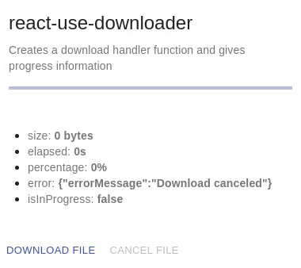

<!-- ALL-CONTRIBUTORS-BADGE:START - Do not remove or modify this section -->
[](#contributors-)
<!-- ALL-CONTRIBUTORS-BADGE:END -->

# react-use-downloader

> Creates a download handler function with its progress information and cancel ability.

[](https://www.npmjs.com/package/react-use-downloader)

---

| Statements                                                                                      | Branches                                                                                 | Functions                                                                                     | Lines                                                                                 |
| ----------------------------------------------------------------------------------------------- | ---------------------------------------------------------------------------------------- | --------------------------------------------------------------------------------------------- | ------------------------------------------------------------------------------------- |
|  |  |  |  |

## Table of Contents

- [Running example](#running-example)
- [Install](#install)
- [Usage](#usage)
- [Documentation](#documentation)
- [License](#license)

---

## Running example

| Plain                                                           |
| --------------------------------------------------------------- |
|                                  |
| [Preview!](https://codesandbox.io/s/react-use-downloader-0zzoq) |

> You may find another [example](./example) in this project which are served at [Github Pages](https://olavoparno.github.io/react-use-downloader).

---

## Install

```bash
npm install --save react-use-downloader
```

---

## Usage

```jsx
import React from 'react';
import useDownloader from 'react-use-downloader';

export default function App() {
  const { size, elapsed, percentage, download, cancel, error, isInProgress } =
    useDownloader();

  const fileUrl =
    'https://upload.wikimedia.org/wikipedia/commons/4/4d/%D0%93%D0%BE%D0%B2%D0%B5%D1%80%D0%BB%D0%B0_%D1%96_%D0%9F%D0%B5%D1%82%D1%80%D0%BE%D1%81_%D0%B2_%D0%BF%D1%80%D0%BE%D0%BC%D1%96%D0%BD%D1%8F%D1%85_%D0%B2%D1%80%D0%B0%D0%BD%D1%96%D1%88%D0%BD%D1%8C%D0%BE%D0%B3%D0%BE_%D1%81%D0%BE%D0%BD%D1%86%D1%8F.jpg';
  const filename = 'beautiful-carpathia.jpg';

  return (
    <div className="App">
      <p>Download is in {isInProgress ? 'in progress' : 'stopped'}</p>
      <button onClick={() => download(fileUrl, filename)}>
        Click to download the file
      </button>
      <button onClick={() => cancel()}>Cancel the download</button>
      <p>Download size in bytes {size}</p>
      <label for="file">Downloading progress:</label>
      <progress id="file" value={percentage} max="100" />
      <p>Elapsed time in seconds {elapsed}</p>
      {error && <p>possible error {JSON.stringify(error)}</p>}
    </div>
  );
}
```

---

## Documentation

`useDownloader()` returns:

- An object with the following keys:

| key          | description                      | arguments                                                 |
| ------------ | -------------------------------- | --------------------------------------------------------- |
| size         | size in bytes                    | n/a                                                       |
| elapsed      | elapsed time in seconds          | n/a                                                       |
| percentage   | percentage in string             | n/a                                                       |
| download     | download function handler        | (downloadUrl: string, filename: string, timeout?: number) |
| cancel       | cancel function handler          | n/a                                                       |
| error        | error object from the request    | n/a                                                       |
| isInProgress | boolean denoting download status | n/a                                                       |

```jsx
const { size, elapsed, percentage, download, cancel, error, isInProgress } =
  useDownloader();
```

`useDownloader(options?: UseDownloaderOptions)` also accepts fetch's RequestInit options:

- Ex.:

```jsx
const { download } = useDownloader({
  mode: 'no-cors',
  credentials: 'include',
  headers: {
    Authorization: 'Bearer TOKEN',
  },
});
```

---

## Contributors ✨

Thanks goes to these wonderful people ([emoji key](https://allcontributors.org/docs/en/emoji-key)):

<!-- ALL-CONTRIBUTORS-LIST:START - Do not remove or modify this section -->
<!-- prettier-ignore-start -->
<!-- markdownlint-disable -->
<table>
  <tbody>
    <tr>
      <td align="center"><a href="https://semeniuc.ml/"><br /><sub><b>Eric Semeniuc</b></sub></a><br /><a href="#ideas-esemeniuc" title="Ideas, Planning, & Feedback">🤔</a></td>
      <td align="center"><a href="https://github.com/davdi1337"><br /><sub><b>davdi1337</b></sub></a><br /><a href="https://github.com/olavoparno/react-use-downloader/commits?author=davdi1337" title="Code">💻</a> <a href="https://github.com/olavoparno/react-use-downloader/issues?q=author%3Adavdi1337" title="Bug reports">🐛</a></td>
      <td align="center"><a href="https://heliusit.net"><br /><sub><b>Mauro Stepanoski</b></sub></a><br /><a href="#ideas-mastepanoski" title="Ideas, Planning, & Feedback">🤔</a> <a href="https://github.com/olavoparno/react-use-downloader/commits?author=mastepanoski" title="Code">💻</a></td>
    </tr>
  </tbody>
</table>

<!-- markdownlint-restore -->
<!-- prettier-ignore-end -->

<!-- ALL-CONTRIBUTORS-LIST:END -->

This project follows the [all-contributors](https://github.com/all-contributors/all-contributors) specification. Contributions of any kind welcome!

---

## License

react-use-downloader is [MIT licensed](./LICENSE).

---

This hook is created using [create-react-hook](https://github.com/hermanya/create-react-hook).
